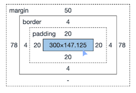

# Box Model

```css
.BoxModel {
   display: block;
}
```

Contains:
-	Margin
-	Border
-	Padding
-	Content (blue section below)

 

Key Features:
- Margins are outside an element, can collapse between elements.
- Paddings are inside an element around the content.
- Elements stacks on top,
- Reserves full line for the element; allows elements to be centered

