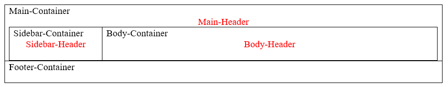

# Containers & Wrappers  

**Containers** are major sections within the BODY of the document.  Thee are used to segment the page and separate by function on the page.   

**Wrappers** are to hold the data to be displayed. Divisions provide upper level formating, paragraphs contain the information, and the SPAN is to modify small segments of text within a paragraph. 


### Container & Section Elements
| Element|Notes|Roadmap |  
| --- | --- | --- |  
| Division|class="column-container" <BR> class="column-of-two" <BR> class="column-of-three"|<DIV class="<Class>" id="<IDName>">  </DIV> |  
| Article|Container|`<ARTICLE>…</ARTICLE>` |  
| Header|Container|`<HEADER>…</HEADER>` |  
| Aside|Container|`<ASIDE>…</ASIDE>` |  
| Section|Container|`<SECTION>…</SECTION>` |  
| ContentContainer||`<CONTENT>…</CONTENT>` |  
| Footer|Container|`<FOOTER>…</FOOTER>` |  
| Navigation|Container|`<NAV>  </NAV>` |  
| Division| Wrapper | `<DIV>  </DIV>` |  
| Paragraph|class="centered"|`<P class="<Class>" id="<IDName>">  </P>` |  
| Span|Wrapper: Used for small area style changes or identification of an area in the document. |`<SPAN class="<Class>" id="<IDName>"></SPAN>` |  

***PLACE DIV-P-SPAN GRAPHIC HERE!***

#### Make a Custom Container or Wrapper
'''html
<DIV class="ContainerName">
</DIV>
<DIV class="WrapperName">
</DIV>
```

## Article  
```html
<ARTICLE id="" class="">…</ARTICLE>
```

## Aside  
```html
<ASIDE id="" >…</ASIDE>
```

## Div  (Division)  
```html
<DIV id="" class=""></DIV>
```

```html
<div class="small center">
  <p> </p>
  <p> </p>
</div>
```

## Footer  
```html
<FOOTER id="" class="">…</FOOTER>
```

## Header  
```html
<HEADER id="" class="">…</HEADER>
```

## Main  
```html
<MAIN role="main" id="" class="">…</MAIN>
```

## Nav  
```html
<NAV id="" class=""></NAV>
```

## P (Paragraph)  
```html
<DIV id="" class=""></DIV>
```

## Section  
```html
<SECTION id="" class="">…</SECTION>
```

## Span  
```html
<SPAN id="" class=""></SPAN>
```

# Examples

## Content Section with Two Columns 

Requires Bootstrap, row & col are Bootstrap classes
```html
<div id="ContentBody">
  <div class="row">
    <div id="LeftSide" class="col">
      <h5> Left Side Matter</h5>
    </div>
    <div id="RightSide" class="col">
      <h5> Right Side Matter</h5>
    </div>
  </div>
</div>
```
```css
#ContentBody{
  background-color:#04272f;
}
#ContentBody h5 {
  Color: white;
}
```

## Top News Digests

Requires Bootstrap, row & col are Bootstrap classes
```html
<!-- Top News -->
<div id="NewsContainer" class="MainSection">
  <div class="MainSectionTitle">
    
    Top News
  </div>
  <div id="News">
    <div class="row">
      <div class="col"> <h5>A</h5> [Digest Items go here] </div>
      <div class="col"> <h5>B</h5> [Digest Items go here] </div>
    </div>
  </div>
</div>  <!-- End of Top News You Can Use -->
```

### Containers
```css
/* Container Classes */
.MainSection {
  background-color: #cbcbc9;
  color: #000; 
  margin: 10px;
  border-radius: 5px;
}
.MainSectionTitle {
  background-color: #8f8f8a;
  color: #000;
  padding-left: 20px;
  height: 28px;
}
.MainSectionTitle img {
  height: 20px;
  margin-top: 6px;
  margin-bottom: 6px;
  margin-left: 16px;
  margin-right: 16px;
}
#NewsContainer {
  margin-top: 20px;
  margin-right: 15px;
}
#News {
  min-height: 235px;
}
```

### Digests
```css
/* Digest Classes */

.DigestItem {
  border: .5px;
  border-radius: 5px;
  border-style: solid;
  margin-top: 10px;
  margin-bottom: 5px;
  margin-right: 10px;
  margin-left: 10px;
  border-color: #8f4330;
}
.DigestItem {
  background-color: #fdf2eb;
}
.DigestItem p {
  margin: 6px;
}
.DigestTitle {
  color: #746853;
  text-decoration: none;
  font-size: 1.1em;
  font-family: Calibri;
  font-weight: 400px
}
.DigestText {
  color:#04272f;
  text-decoration: none;
  font-size:.8em;
  font-family: Calibri;
}
.Digest a:hover {
  text-decoration: none;
}
```

## Focus Content Section
Requires Bootstrap, row & col are Bootstrap classes
```html
<div id="Focus" class="row">
<div class="mainSection col">
   <div class="focusTitle">Focus</div>
     <div id="FocusContent">
       <div class="row">
         <div class="col" style="margin-top:10px">
         </div>
         <div class="col" style="margin-top:10px">
         </div>
         <div class="col" style="margin-top:10px">
         </div>
         <div class="col" style="margin-top:10px">
         </div>
      </div>
    </div>
  </div>
  <div id="Framework" class="MainSection col-3">
    <div class="MainSectionTitle">Strategic Framework</div>
    <div id="FrameworkContent">
   </div>
  </div>
  <div id="EmergencyLinks" class="MainSection col-lg-3">
    <div class="MainSectionTitle">Emergency</div>
      <div id="EmergencyText">
        <div class="row">
          <div class="col"> [Emergency Items List] </div>
        </div>
      </div>
    </div>
  </div>
</div>  <!-- End of Commander Focus -->
</div>  <!—End of Row -->
```
```css
#EmergencyLinks {
  margin-right: 30px;
  padding-left: 0;
  padding-right: 0
}
#EmergencyLinks a {
  color:#04272f;
  text-decoration: none;
  font-size: 14px;
}
#EmergencyText {
  margin-right: 15px;
  margin-left: 20px
}
#Focus {
  background-color: #8f8f8a;
  margin-left: 30px;
  padding-left: 0;
  padding-right: 0;
}
#Focus a {
  color: #04272f;
  text-decoration: none;
  font-size: 14px;
}
#FocusContent {
  margin-left: 20px;
  margin-right: 15px;
}
#Framework { 
  padding-left: 0;
  padding-right: 0;
}
#FrameworkContent {
  text-align: center;
}
.Emergency {
  background-color: #ff6122;
}
.Emergency p:first-child {
  color: #ff0;
}
.focusTitle {
  background-color: #cbcbc9;
  color: #000;
  padding-left: 20px;
  height: 28px
}
.mainSection {
  background-color: #cbcbc9;
  color: #000;
  margin: 10px;
  border-radius: 5px;
}
.MainSectionTitle{
  background-color: #8f8f8a;
  color: #000;
  padding-left: 20px;
  height: 28px
}
.MainSectionTitle img {
  height: 20px;
  margin-top: 6px;
  margin-bottom: 6px;
  margin-left: 16px;
  margin-right: 16px;
}
```

## Main Section

Requires Bootstrap, row & col are Bootstrap classes
```html
<div id="Misc" class="MainSection">
  <div class="row">
    <div class="col-2">
    </div>
    <div class="col-4">
    </div>
    <div class="col-4">
    </div>
    <div class="col-2">
    </div>
  </div>  <!-- End of Row -->
</div>  <!-- End of Misc-MainSection -->
```
```css
#Misc {
  background-color: #97a3a4;
  margin-right: 15px;
  margin-left: 15px;
  padding: 15px;
  font-size: 0.9em;
}
#Misc a {
  color:#04272f;
  text-decoration:none
  ;font-size:14px;
}
#Misc h5 {
  text-shadow:1px 1px #8f8f8a;
}
.mainSection {
  background-color: #cbcbc9;
  color: #000;
  margin: 10px;
  border-radius: 5px;
}
```

## Use a Wrapper to store & hide variables
```javascript
<div id="storeStartTime" class="hidden"></div>
<p id="storeAnythingAtAll" class="hidden">3</p>
<p id="storeExercises" class="hidden">4,5,6,7,8,9,10,11,12,13,14,15,16,17,18,19</p>
<p id="storeFastestTime" class="hidden"></p>
<p id="storeAnything" class="hidden"></p>
<p id="storeAnythingElse" class="hidden"></p>
<p id="storeRegEx" class="hidden"></p>
<p id="timerStarted" class="hidden"></p>
<p id="timerMultiple" class="hidden">1</p>
<p id="testMode" class="hidden">0</p>
```

## Accessibility (ARIA Support)
| Action | HTML | CSS |  
| --- | --- | --- |  
| Bread Crumbs | `<div id="breadcrumb-container">` <BR> `<ol id="breadcrumbs" aria-label="Breadcrumbs"></ol>` <BR> `</div>` | `#breadcrumb-container {` <BR> `}` <BR> `#breadcrumbs {` <BR> `}` |  

## Box System fot Simple Web Page 

  

| Action | HTML | CSS |  
| --- | --- | --- |  
| Body-Container | `<div id="body-container"></div> <!-- \#body-container -->` | `#body-container {` <BR> `}` |  
| Body-Header | `<div id="body-header">` <BR> `  <h1 id="body-header-text"></h1>` <BR> `</div> <!-- \#body-header -->` | `#body-header {` <BR> `}` |  
| Footer-Container | `<div id="footer-container role="contentinfo">` <BR> `  <section class="footer-body">` <BR> `</section>` <BR> `</div> <!-- \#footer-container -->` | `#footer-container {` <BR> `}` |  
| Main-Container | `<div id="main-container"></div> <!-- \#main-container -->` | `#main-container {` <BR> `}` |  
| Main-Header | `<div id="main-header">` <BR> `  <h1 id="main-header-text"></h1>` <BR> `</div> <!-- \#main-header -->` | `#main-header {` <BR> `}` |  
| Sidebar Container | `<div id="sidebar-container"></div> <!-- \#sidebar-container -->` | `#sidebar-container {` <BR> `}` |  
| Sidebar-Header | `<div id="sidebar-header">` <BR> `  <h1 id="sidebar-header-text"></h1>` <BR> `</div> <!-- \#sidebar-header -->` | ``#sidebar-header {` <BR> `}`` | 

## Code Wrapper for HTML
```html
<q lang="html">A quote in a paragraph</q>
```
```css
q:lang(html) {
  quotes: "<" ">";
}
```
  
## Notifications
```html
<p class="greenStatus"> A Green Status Condition </p>
<p class="yellowStatus"> A Yellow Status Condition </p>
<p class="redStatus">A Red Status Condition</p>
```
```css
.greenStatus {
  background-color: #000;
  color: green;
  font-weight: bold;
}
.redStatus {
  background-color: #000;
  color: red;
  font-weight: bold;
}
.yellowStatus {
  background-color: #000;
  color: yellow;
  font-weight: bold;
}
```
  
