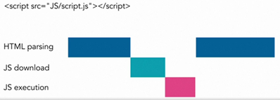
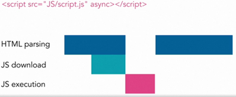
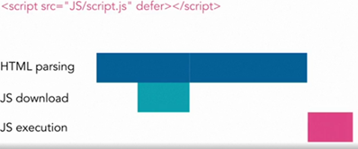

# WebDev Scripts

## Common Script Calls
```javascript
<SCRIPT type =”text/javascript” src="http://platform.twitter.com/widgets.js"></SCRIPT>
```

## Script Element Attributes
| Attribute | Description | Notes & Examples |  
| --- | --- | --- |  
| async | Asynchronous File Load | async="{ yes \| no }" | 
| defer | Defer Script redering with async file load |  |  
| id |  |  |  
| language | Old form of type/deprecated |  |  
| src | Source URL |  |  
| type | MIME type |  |  

#### A Normal Rendering Process  
  

#### A Async Rendering Process  


#### A Defer Rendering Process  



## When Script isn't Allowed
```html
<NOSCRIPT>  </NOSCRIPT>
```

## Script Templates
```html
<script type="text/x-template" title="gliffy-webpanel-footer">
  <div class="gliffy-webpanel-footer"><span></span></div>
</script>
```

